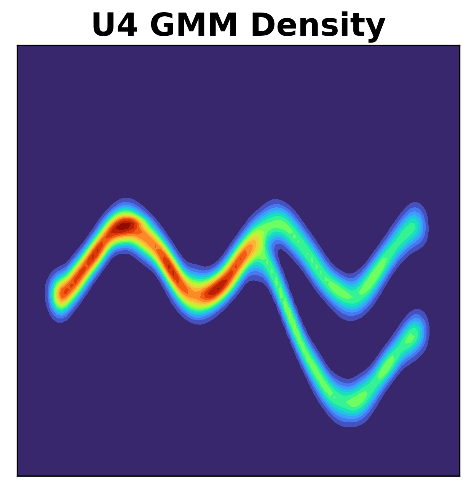
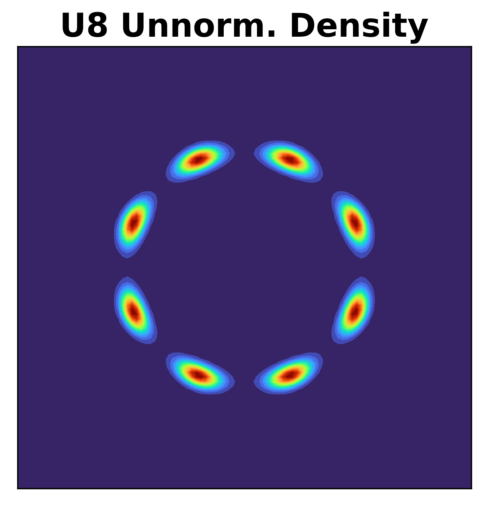
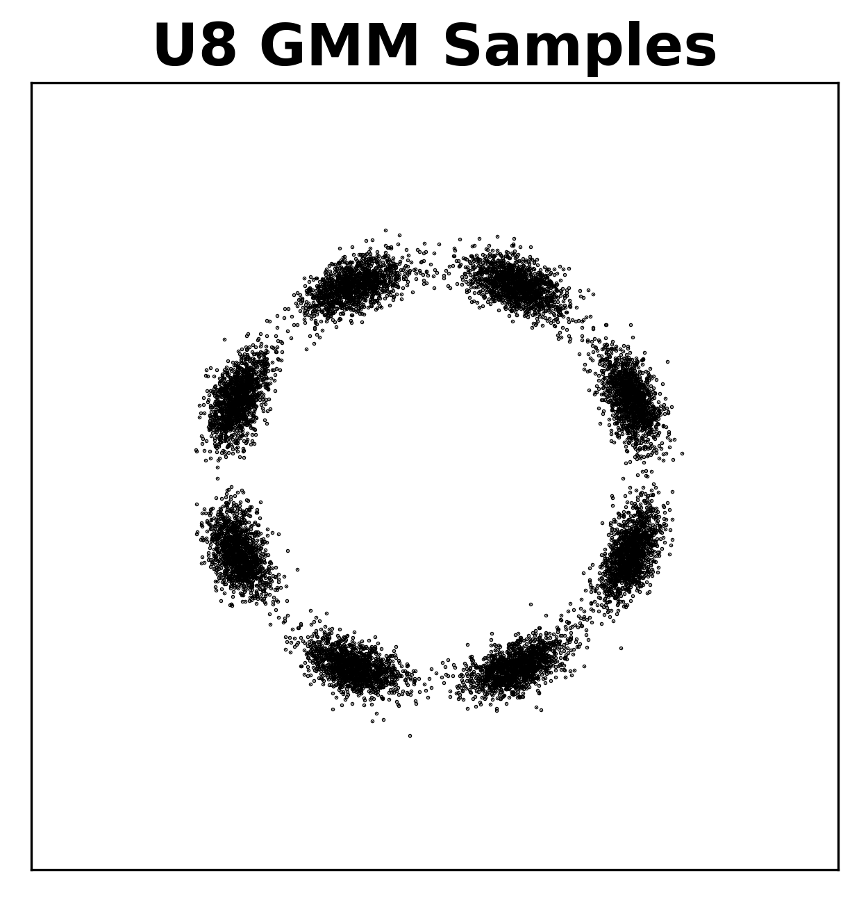

# Masked autoregressive flow
Modular PyTorch code for fully reproducing

```bibtex
@article{papamakarios2017masked,
  title={Masked autoregressive flow for density estimation},
  author={Papamakarios, George and Pavlakou, Theo and Murray, Iain},
  journal={Advances in neural information processing systems},
  volume={30},
  year={2017}
}
```

Here's a quick example of how you fit MADE to a dataset of your choice:

```python
data = torch.from_numpy(your_data)  # (batch_size, data_dim)
model = MADE(data_dim=data.shape[1], hidden_dims=[100, 100])
opt = optim.Adam(model.parameters(), lr=1e-3)
for i in range(1000):  # using entire dataset each time
    loss = - model.log_prob(data).mean()
    opt.zero_grad()
    loss.backward()
    opt.step()
    print(float(loss))
```

## Task 1: 2D density estimation

### Potential function U1

|            Unnormalized density            |              GMM (50) density              |                GMM samples                 |
| :----------------------------------------: | :----------------------------------------: | :----------------------------------------: |
|  |  |  |

### Potential function U2

|             Unnormalized density              |               GMM-50 density               |                GMM samples                 |
| :-------------------------------------------: | :----------------------------------------: | :----------------------------------------: |
|  |  |  |

| MADE | MADE-MOG | MAF (20) | MAF (20) (fixed order) | MAF-MOG (20) |
| :--: | :------: | :------: | :--------------------: | :----------: |
|      |          |          |                        |              |

### Potential function U3

|                  Unnormalized density                   |                    GMM-50 density                    |                GMM samples                 |
| :-----------------------------------------------------: | :--------------------------------------------------: | :----------------------------------------: |
|  |  |  |

| MADE | MADE-MOG | MAF (20) | MAF (20) (fixed order) | MAF-MOG (20) |
| :--: | :------: | :------: | :--------------------: | :----------: |
|      |          |          |                        |              |

### Potential function U4

|             Unnormalized density              |               GMM-50 density               |                GMM samples                 |
| :-------------------------------------------: | :----------------------------------------: | :----------------------------------------: |
|  |  |  |

| MADE | MADE-MOG | MAF (20) | MAF (20) (fixed order) | MAF-MOG (20) |
| :--: | :------: | :------: | :--------------------: | :----------: |
|      |          |          |                        |              |

### Potential function U8

|             Unnormalized density              |               GMM-50 density               |                GMM samples                 |
| :-------------------------------------------: | :----------------------------------------: | :----------------------------------------: |
|  |  |  |

| MADE | MADE-MOG | MAF (20) | MAF (20) (fixed order) | MAF-MOG (20) |
| :--: | :------: | :------: | :--------------------: | :----------: |
|      |          |          |                        |              |

## Task 2: High-dimensional density estimation

TODO

## Task 3: High-dimensional density estimation (conditional)

TODO
