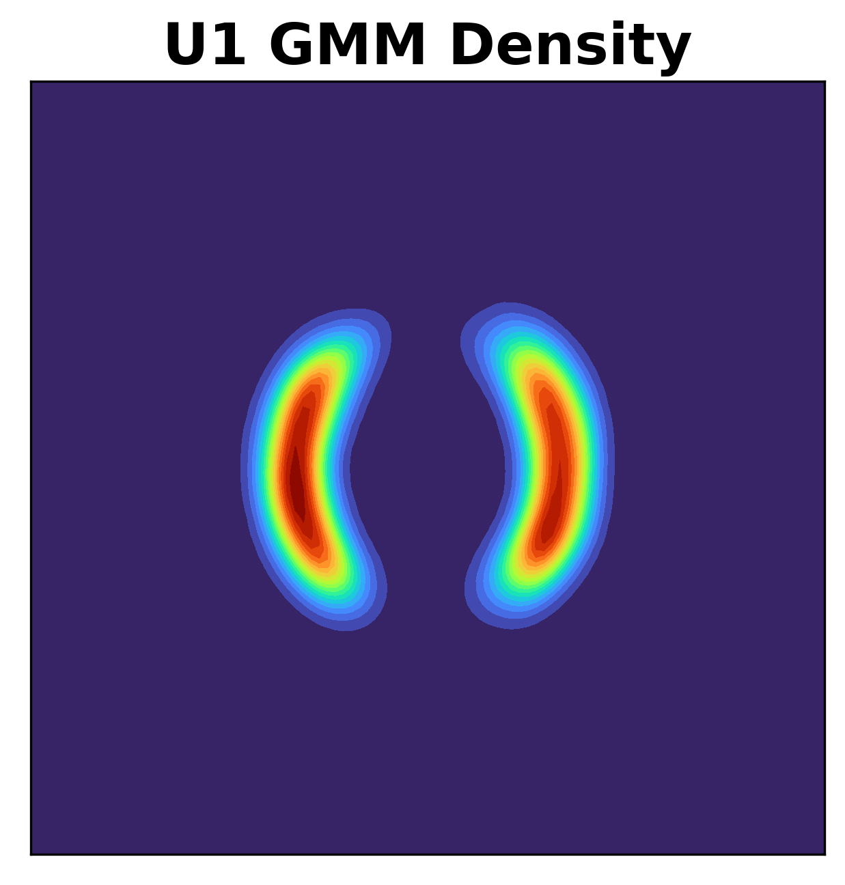

# Masked autoregressive flow
Modular PyTorch code for fully reproducing

```bibtex
@article{papamakarios2017masked,
  title={Masked autoregressive flow for density estimation},
  author={Papamakarios, George and Pavlakou, Theo and Murray, Iain},
  journal={Advances in neural information processing systems},
  volume={30},
  year={2017}
}
```

Here's a quick example of how you fit MADE to a dataset of your choice:

```python
data = torch.from_numpy(your_data)  # (batch_size, data_dim)
model = MADE(data_dim=data.shape[1], hidden_dims=[100, 100])
opt = optim.Adam(model.parameters(), lr=1e-3)
for i in range(1000):  # using entire dataset each time
    loss = - model.log_prob(data).mean()
    opt.zero_grad()
    loss.backward()
    opt.step()
    print(float(loss))
```

## Task 1: 2D density estimation

### Potential function U1

Unnormalized density, estimated density by GMM with 50 components (fitted using VI), and samples from it:

<p align="middle">
  
   
  
</p>

Estimated densities (trained on GMM samples):

<p align="middle">
  
   
  
  
  
</p>   

Command line code:

```bash
python 2d_density_estimation.py U1 made 1
python 2d_density_estimation.py U1 made-mog 1
python 2d_density_estimation.py U1 maf 1 -num_ar_layers=20 -alternate_input_order=1
python 2d_density_estimation.py U1 maf 1 -num_ar_layers=20 -alternate_input_order=0
python 2d_density_estimation.py U1 maf-mog 1 -num_ar_layers=5 -alternate_input_order=1
```

### Potential function U2

### Potential function U3

### Potential function U4

### Potential function U8

## Task 2: High-dimensional density estimation

TODO

## Task 3: High-dimensional density estimation (conditional)

TODO
