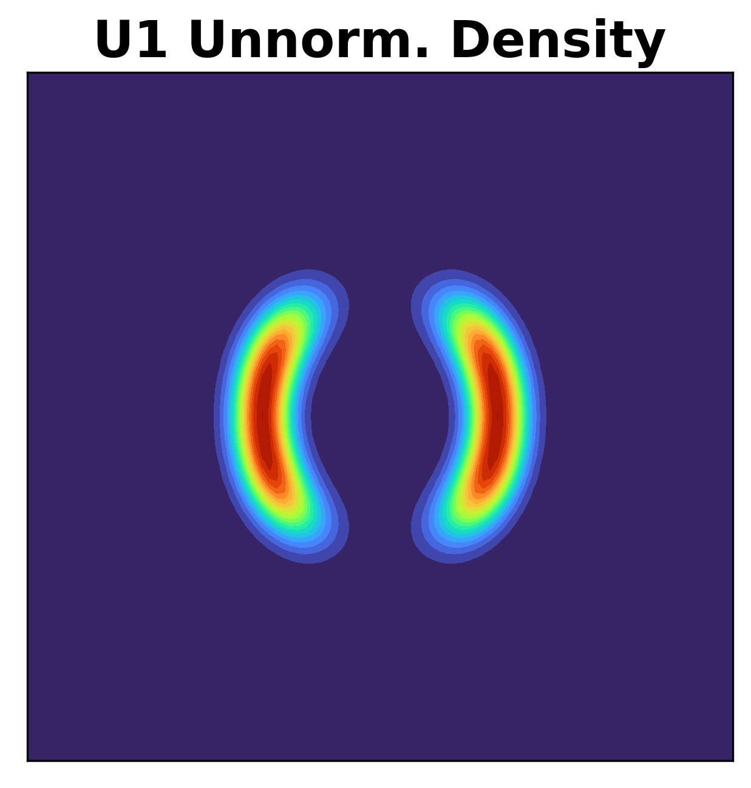
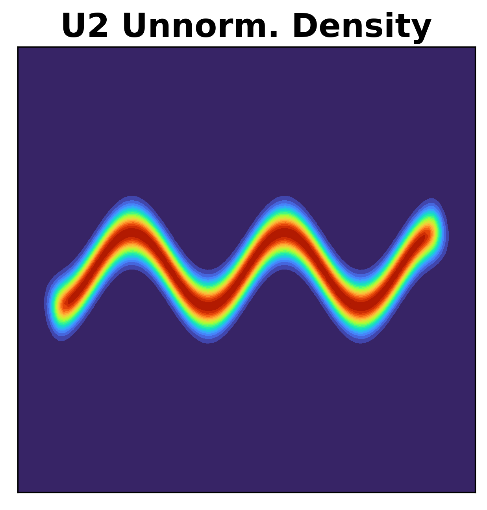
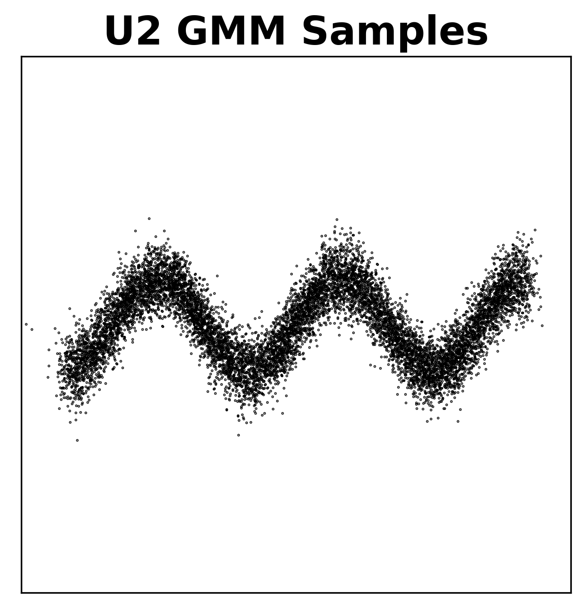
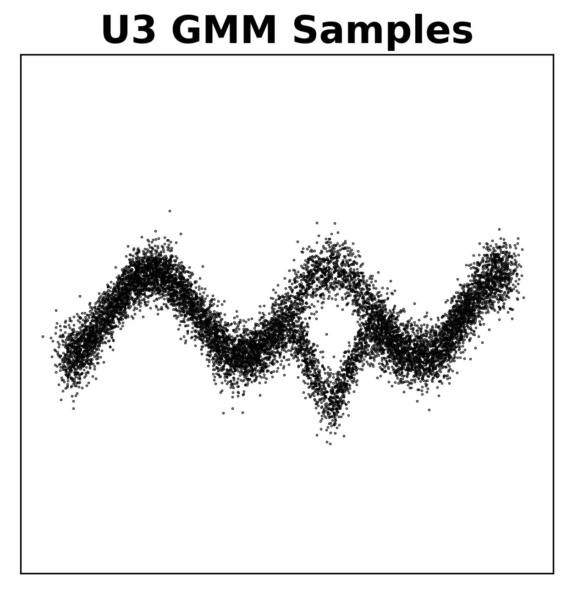
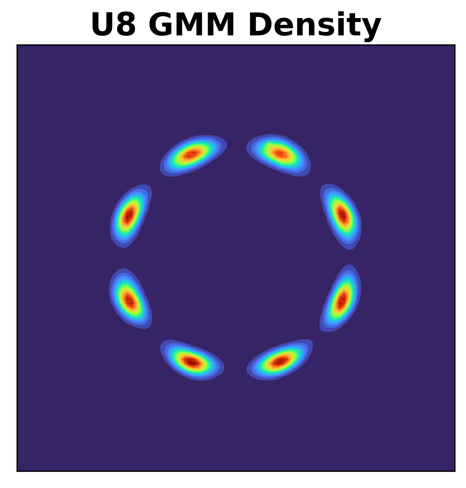
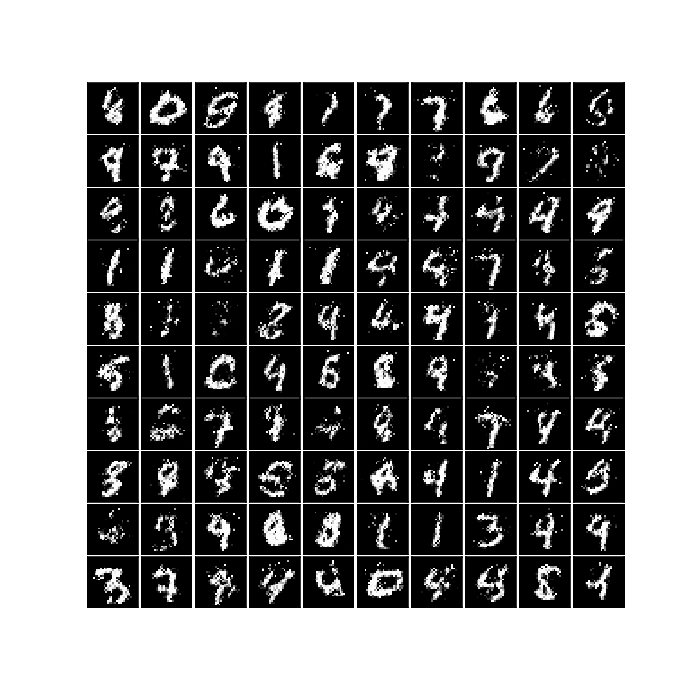

# Masked autoregressive flow
This repository contains some demo PyTorch code for

```bibtex
@article{papamakarios2017masked,
  title={Masked autoregressive flow for density estimation},
  author={Papamakarios, George and Pavlakou, Theo and Murray, Iain},
  journal={Advances in neural information processing systems},
  volume={30},
  year={2017}
}
```

Here's a quick example of how can you fit a neural density model to a custom dataset:

```python
data = torch.from_numpy(your_data)  # (batch_size, data_dim)

dist = MADE(data_dim=data.shape[1], hidden_dims=[100, 100])  # dist for distribution
dist = MADE_MOG(data_dim=data.shape[1], hidden_dims=[100, 100], num_components=10)
dist = MAF(data_dim=data.shape[1], hidden_dims=[100, 100], num_ar_layers=5)
dist = MAF_MOG(data_dim=data.shape[1], hidden_dims=[100, 100], num_ar_layers=5, num_components=10)

opt = optim.Adam(dist.parameters(), lr=1e-3)

for i in range(1000):  # using entire dataset each time
    loss = - dist.log_prob(data).mean()
    opt.zero_grad()
    loss.backward()
    opt.step()
    print(float(loss))
```

Please see **Implementation notes** for an important code-level detail.

## Task 1: 2D density estimation

In the following plots, the horizontal axes represent $x_1$ and the vertical axes represent $x_2$.  All datasets (GMM samples) were generated using `maf/generate_2d_data.ipynb`. All models used sequential input order, i.e., $p(x_1 , x_2) = p(x_1) p(x_2|x_1)$.

Training code is `maf/2d_density_estimation.py`. Sampling code is `maf/generate_2d_data_from_trained_model.ipynb` (I didn't put the plots of samples below but you can check them out there). 

### Potential function U1

Unnormalized density, estimated density by GMM with 50 components (fitted using VI), and samples from it:

<p align="middle">
  
   
  
</p>

Estimated densities (trained on GMM samples):

<p align="middle">
  
  
  
   
  
</p>   

Command line code:

```bash
python 2d_density_estimation.py U1 made 1
python 2d_density_estimation.py U1 made-mog 1
python 2d_density_estimation.py U1 maf 1 -num_ar_layers=10 -alternate_input_order=1
python 2d_density_estimation.py U1 maf 1 -num_ar_layers=10 -alternate_input_order=0
python 2d_density_estimation.py U1 maf-mog 1 -num_ar_layers=5 -alternate_input_order=1
```

### Potential function U2

Unnormalized density, estimated density by GMM, and samples from it:

<p align="middle">
  
   
  
</p>

Estimated densities:

<p align="middle">
  
  
  
   
  
</p>   


Command line code:

```bash
python 2d_density_estimation.py U2 made 1
python 2d_density_estimation.py U2 made-mog 1
python 2d_density_estimation.py U2 maf 1 -num_ar_layers=10 -alternate_input_order=1
python 2d_density_estimation.py U2 maf 1 -num_ar_layers=10 -alternate_input_order=0
python 2d_density_estimation.py U2 maf-mog 1 -num_ar_layers=5 -alternate_input_order=1
```

### Potential function U3

Unnormalized density, estimated density by GMM, and samples from it:

<p align="middle">
  
   
  
</p>

Estimated densities:

<p align="middle">
  
  
  
   
  
</p>   


Command line code:

```bash
python 2d_density_estimation.py U3 made 1
python 2d_density_estimation.py U3 made-mog 1
python 2d_density_estimation.py U3 maf 1 -num_ar_layers=10 -alternate_input_order=1
python 2d_density_estimation.py U3 maf 1 -num_ar_layers=10 -alternate_input_order=0
python 2d_density_estimation.py U3 maf-mog 1 -num_ar_layers=5 -alternate_input_order=1
```

### Potential function U4

Unnormalized density, estimated density by GMM, and samples from it:

<p align="middle">
  
   
  
</p>

Estimated densities:

<p align="middle">
  
  
  
   
  
</p>   


Command line code (using seed 1 for MAF (20) led to numerical problems for some reason):

```bash
python 2d_density_estimation.py U4 made 1
python 2d_density_estimation.py U4 made-mog 1
python 2d_density_estimation.py U4 maf 1 -num_ar_layers=10 -alternate_input_order=1
python 2d_density_estimation.py U4 maf 1 -num_ar_layers=10 -alternate_input_order=0
python 2d_density_estimation.py U4 maf-mog 1 -num_ar_layers=5 -alternate_input_order=1
```

### Potential function U8

Unnormalized density, estimated density by GMM, and samples from it:

<p align="middle">
  
   
  
</p>

Estimated densities:

<p align="middle">
  
  
  
   
  
</p>   


Command line code:

```bash
python 2d_density_estimation.py U8 made 1
python 2d_density_estimation.py U8 made-mog 1
python 2d_density_estimation.py U8 maf 1 -num_ar_layers=10 -alternate_input_order=1
python 2d_density_estimation.py U8 maf 1 -num_ar_layers=10 -alternate_input_order=0
python 2d_density_estimation.py U8 maf-mog 1 -num_ar_layers=5 -alternate_input_order=1
```

## Task 2: High-dimensional density estimation

MADE-MOG samples:

<p align="middle">
  
</p>

See `mnist_density_estimation.ipynb` for preprocessing, training and sampling code.

## Task 3: High-dimensional density estimation (conditional)

Maybe in the future

## Implementation notes

I found MAF to be unstable if I stack many layers (e.g., 20). In particular, the test loss would explode and be highly volatile. I highly suspect this is due to this line of code:

```python
u = (x - mean) * one_over_std
```

Since `one_over_std` also depends on `x`, it could be erroneously high for out-of-distribution data (e.g., test data). Since batch norm parameters only come from training data, they could be bad at normalizing such high values. These high values would then be fed to the next layer, which further extracerbates the out-of-distribution problem. To combat this issue, I put a lower and upper limit on `one_over_std` through the use of sigmoid activation.
